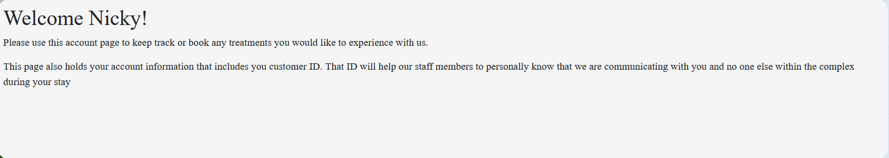
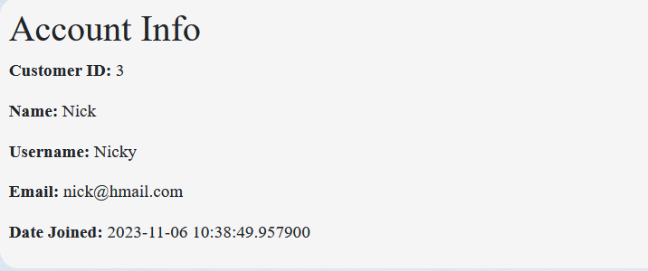

# The Personal Salon App

 This web application has been created so that clients can book their treatments on any particular day and time they want. 

 [View the live project here](https://)

 ## Contents
 
1. [User Experience](#user-experience)
2. [Design](#design)
3. [Features](#features)
4. [Technologies Used](#technologies-used)
5. [Testing](#testing)
6. [Credits](#credits)

## User Experience

### The Idea
The objective of this app is to give the user an easy way to book treatments in the palm of their hands whilst they stay at the spa. 

#### Site details include
* Account registration page to sign up upon arrival
* Login page to log into the application
* Their own account page with personal details and information about their treatments
* Booking form where clients can book treatments at the spa
* Ability to edit and delete appointments on the account page with a click of a button
* Log out button to log out of current session within the application

#### Client Goals

* To be able to view the site on a range of device sizes
* To be able to log in anywhere within the spa and book appointments with their chosen day, time, time of day and treatment type
* To edit the appointment if needed
* To delete appointment if needed

#### First Time Visitor Goals

* Sign up
* Book treatments whilst at the spa

#### Returning Visitor Goals 

* Sign in
* Edit or delete treatments 

## Design

### Layout 
I wanted a simplistic layout where there isn't too much happening on each screen so that the user can clearly see where they need to look and where the vital information is, for example their chosen appointments. 

### Typography
I wanted a plain and simple font so it was easy to read. Google Fonts was used to import a couple of fonts that I used and they were:

* cormorant-garamond - Used for all main text
* Tangerine - Used on the home page for a fancier look to the heading

### Database Schema
I chose to create a relational database as the user will have to be connected to their own booking appointment. The user will create ea login via the registration form inputting their full name, along with their email and chosen username and password. The booking column at the end will link the user database with the booking database that will contain all what is needed to book the appointment, along with the user ID column that is the foreign key linking the user to that booking ID. 

## Features

The website is made up of 6 pages:

* Log In
* Registration
* Account Dashboard
* Booking Form Page
* Edit Booking Form (Change of Appointments)
* Error Pages

The background image used for all the site is just a simple generic salon image taken from unplash.

### Log In page

The log in page is the main page clients will see first. They have a welcome message that introduces them to the spa and explains what the app allows them to do. 

   

   Also on the page is:

   * Navbar with spa name
   * Log in link button which acts as a home page link
   * Register link button that sends the user to a form where they can register to the app
   * Footer that contains copyright information

#### Log In Form

The log in form contains two input types where clients enter their username and password to log into their account. There are validators that will not allow the clients to log in if no account has been created.

There is also a remember me checkbox that allows the user to save their username and password to save inputting the information again.

A sign up link is also on the page where the user has another way of linking to the registration page.
 

### Register

The registration page allows users to sign up to the application to then allow them to access their account and book treatments.

The form takes the clients: 

* Name
* Email
* Chosen username
* Password

* The form also contains a validation system where input fields will require a certain amount of letters to allow registration to continue. This is for the Name, Email, Username and Password fields. 

* The password is hidden from view and confirmed using two password fields. 
Form validation is set up for all fields and will display if the user leaves any fields blank, or if their passwords do not match.

* A submit button to submit the form. When the form is submitted, this creates a user account, and takes the user to their account page

* A flash message appears on the next page when the user has created a new account successfully or unsuccessfully

### Account Page

The account page is main section of the clients information regarding log information and treatment appointments. 

As you can see the navbar has changed with new links to press. These are:

* Account - This acts as a back button to the user account page if the user wishes to return there

* Book Now - This sends the user to the page where they can book their appointments for the duration of their stay

* Log out - This allows the user to log out the application

#### Welcome Message

This welcome message is just a visual display of information about the spa and what their information is used for. The information is pretty vague but it is only displayed like this so we get an understanding of what could be placed there in the future. 

The username is displayed in the message via Jinja3 language that pulls the clients username from the database and displays it. It gives a more personal feel to the account and can enhance the user experience.

### Account Info

Here you can see the clients information and includes: 

* Customer ID
* Name
* Email
* Date Join

This is all pulled again from the database via Jinja3 language top display to the user information that is required if needed. 
 
### Treatment Section

In this section you can see that the user has booked two appointments and is now visible on their account page via Jinja3 language that is again pulled from the database to then allow the user to see and keep track of their appointments. 

The appointment contains:

* Day - The day the treatment is on
* Time Frame - Time of day (Morning, Afternoon, Evening)
* Time - The actual time of the treatment
* Massage - The treatment under the massage tab and this will be the same for the other selections
* Facials
* Hand and Foot
* Waxing

### Update and Delete

Within the appointment details you can also see an update button with a delete button. Clicking the update button allows the user to update their current appointment giving them the chance to change any of the above details. The delete button deletes the current appointment selected.

### Booking Form

The booking form is where the user can book their treatments. The form contains drop down menus for choosing the majority of what is needed but there is also a text input area where the user will have to select an actual time they want to have the treatment within the time frame selected. There is also a checkbox at the bottom of the form where the user will have to select to confirm the Term and conditions of the spa. This also acts as a validation stage as if this was not selected, the form would not submit via the submit button which is at the bottom.

### Update Form

The update form is the exact same as the booking form with the only difference being the input fields are already populated with the users current selections to help them determine what they are changing from.

### Flash Messages

I have flash messages for many areas of successful or unsuccessful input of data. Green back ground indicates a success whereas a red one represents that something has gone wrong. Below are just a couple of them. 

## Accessibility

I have been mindful during coding to ensure that the website is as accessible as possible. I have achieved this by:

* Using semantic HTML.
* Guaranteeing adequate colour contrast throughout the site.

## Technologies Used

### Languages Used

HTML5, CSS3, Python, Jinja3 were used to create this application.

### Frameworks, Libraries & Programs Used

* **Google Fonts** - To include my two fonts that I used.
* **VSCode** - This was used as my IDE top create the application.
* **GitHub** - This was used to help save my work and used for version control.
* **Snip and Sketch** - This was used for uploading images.
* **FireFox Dev Tools** - This was used to test my code out and used to display my application through the browser.
* **Am I Responsive?** - This was used to show my application on a range of devices.
* **SQLAlchemy** - This was used to connect Python code with the database. 
* **Flask** - I used this framework to build the website.
* **Flexbox** - This was used to help position elements easier.
* **CSS Grid** - This was used to help position elements easier.
* **Bootstrap 5** - This was used to help build the fundamentals of the application in regards to CSS3.
* **PostgreSQL** - This was used to help keep hold of the data of the user..
* **ElephantSQL** - was used to host the database.
* **Heroku** - was used to deploy the website.

## Testing

I carried out testing throughout my project with it being manual testing by inputting values to see if they were getting collected by the database to causing errors within the forms for testing validation rules. FireFox Dev Tools were used as well to help check mainly HTML and CSS code.

Automatic testing was also used with different software such as W3C validator, CSS validator and Python Checker.

## W3C Validator - HTML

* Results from the [Login Page](Salon_app/static/images/readme/logincheck.png) page check: user not logged in.
* Results from the [Account](Salon_app/static/images/readme/accountcheck.png) page check: user logged in.
* Results from the [Booking Form](Salon_app/static/images/readme/bookingformcheck.png) page check.
* Results from the [Update Page](Salon_app/static/images/readme/updateformcheck.png) page check.
* Results from the [Registration Form](Salon_app/static/images/readme/registercheck.png) page check.

## CSS Validator

* Results from the [CSS Check](Salon_app/static/images/readme/CSSchecks.png)

## Python Validator

* Results from the [models.py](Salon_app/static/images/readme/modelscheck.png) check.
* Results from the [routes.py](Salon_app/static/images/readme/routecheck.png) check.
* Results from the [forms.py](Salon_app/static/images/readme/formscheck.png) check.
* Results from the [init.py](Salon_app/static/images/readme/initcheck.png) check.
* Results from the [run.py](Salon_app/static/images/readme/runcheck.png) check.

## Manual Testing

### Links
All links tested and worked.

### Buttons
All buttons clicked and tested and worked.

### Forms
Booking, registration and update form worked fine with all validation errors working along with values being sent to database and update form holding onto current values so the user knows what was there before.

### Database
SQLite3 was used to start off with to test to see if data was being sent via the registration form for new users and the booking form creating appointments. SQLiteAdmin was also used to visually see the data being stored, edited and deleted and proved that it was working once the form was submitted.

As the data was being sent correctly, I changed to Postgresql as this was a more robust object-relational database management system and would then be used to link up to Heroku for final deployment.

## Credits

Various websites and videos were used to help create this application and are listed below.

* [Codemy's Flask Blog walkthrough](https://www.youtube.com/watch?v=0Qxtt4veJIc&list=PLCC34OHNcOtolz2Vd9ZSeSXWc8Bq23yEz&index=1) - Was used heavily to build the foundations of the application.
* [Corey Schafer Flask walkthrough](https://www.youtube.com/watch?v=MwZwr5Tvyxo&list=PL-osiE80TeTs4UjLw5MM6OjgkjFeUxCYH) - Was used to help create a database via the terminal and create user profiles.
* [BootStrap](https://www.youtube.com/watch?v=MwZwr5Tvyxo&list=PL-osiE80TeTs4UjLw5MM6OjgkjFeUxCYH) - Was used to create the Navbar and footer for my site.
* [Flask Documentation](https://flask.palletsprojects.com/en/3.0.x/) - Was used to help understand how flask actually works in certain situations such as flash messages and uploading data to SQLite
* [Jinja](https://jinja.palletsprojects.com/en/3.1.x/) - Like Flask, this was used to help get a better understanding of the Jinja syntax.
* [W3Schools](https://www.w3schools.com/) - Used on occasions to help with page layout and certain CSS tips and tricks.
* [StackOverflow](https://stackoverflow.com/) - Used heavily for coding such as form creation with flask and jinja, displaying the data from the form onto the account page and understanding why data was not being sent to the database.
* [W3Schools](https://www.w3schools.com/) - Used on occasions to help with page layout and certain CSS tips and tricks.
* [Unsplash](https://unsplash.com/) - Was used for my background image.
* [Google Fonts](https://fonts.google.com) - Was used to collect my fonts that were used.
* [FireFox](https://www.mozilla.org/en-GB/firefox/browsers/) - Was used for my chosen browser
* [VSCode](https://code.visualstudio.com/) - Was the IDE that I used to create my application